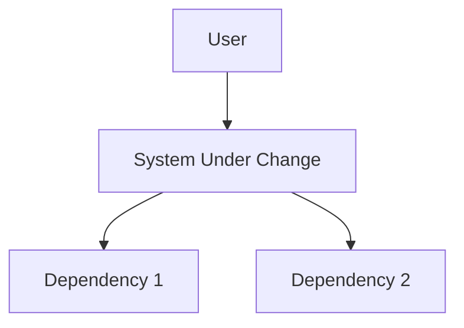
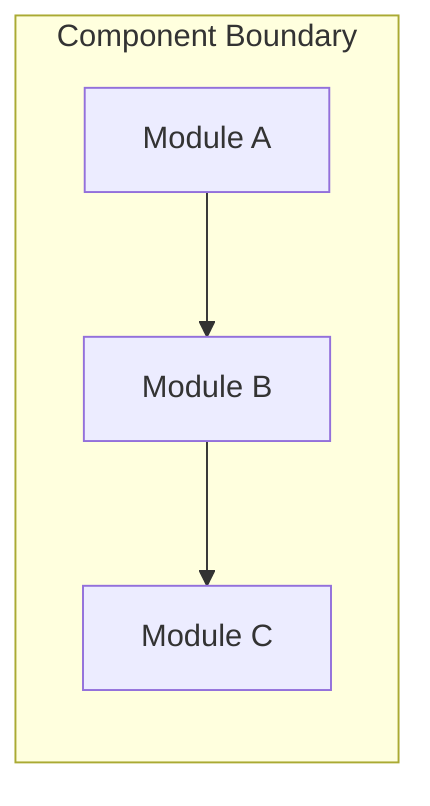
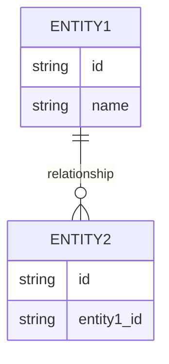
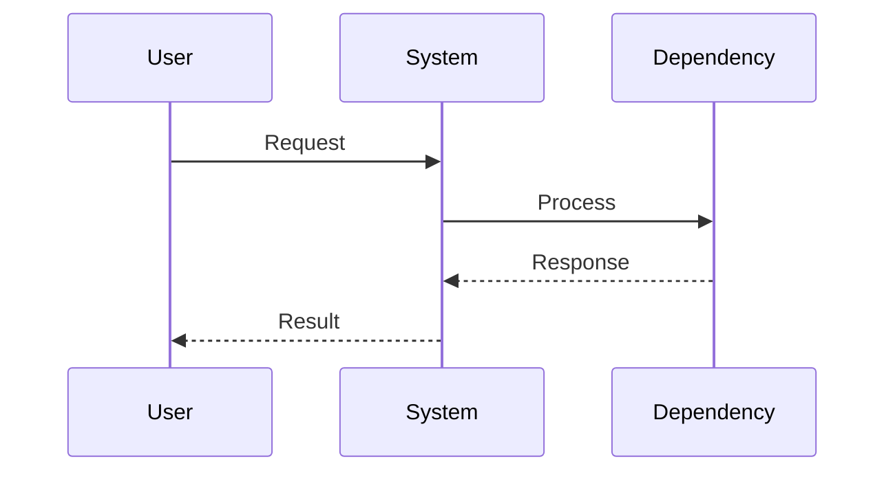
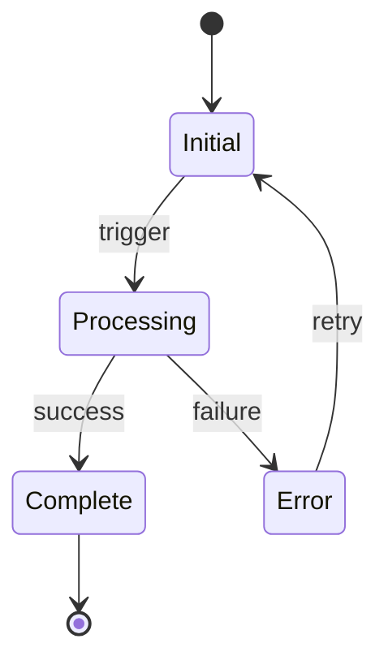

# Software Design Document: {{work-item-id}}

**Version**: 1.0
**Date**: {{YYYY-MM-DD}}
**Author**: {{author}}
**Work Item**: {{work-item-id}} — {{title}}
**Status**: Draft | Review | Approved

---

## 1. Overview

### 1.1 Purpose
Brief description of what this design document covers and why the change is needed.

### 1.2 Scope
What is included and excluded from this design.

### 1.3 References
- Work item: {{work-item-id}}
- Requirements: {{requirement-ids}}
- Related SDDs: {{related-sdds}}

## 2. Architecture

### 2.1 System Context

### 2.2 Component Diagram

### 2.3 Key Design Decisions

| # | Decision | Rationale | Alternatives Rejected |
|---|----------|-----------|----------------------|
| 1 | | | |

## 3. Detailed Design

### 3.1 Data Model

### 3.2 Sequence Diagrams

### 3.3 State Machine (if applicable)

## 4. Interface Changes

### 4.1 API Changes
Describe any new or modified APIs, endpoints, or interfaces.

### 4.2 Configuration Changes
Describe any new or modified configuration options.

## 5. Security Considerations

- Authentication: {{impact}}
- Authorization: {{impact}}
- Data handling: {{impact}}
- OWASP relevance: {{applicable-items}}

## 6. Testing Strategy

| Test Type | Scope | Coverage Target |
|-----------|-------|----------------|
| Unit | | |
| Integration | | |
| Regression | | |

## 7. Rollback Plan

How to revert this change if issues are discovered post-deployment.

## 8. Open Questions

- [ ]

---

*Generated by Harness `/implement` — complete all sections before V&V audit.*
