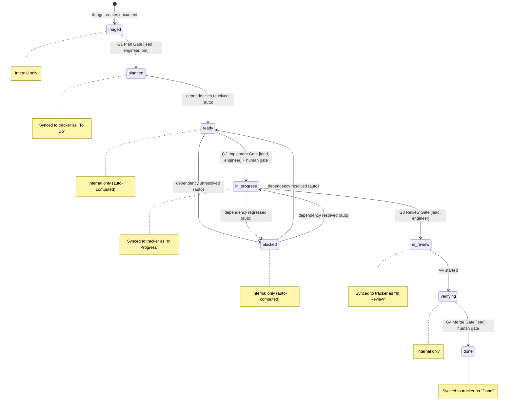

# State Machine Reference

Defines the work item state machine used by `/orchestrate`. States, transitions, guards, and rollback behavior.

---

## State Diagram

---

## State Definitions

### triaged (internal only)

A triage branch exists with a committed document describing this work item's topic.

| Property | Value |
|----------|-------|
| Tracker sync | No — internal only |
| Session state field | `orchestrator.itemStates[id].abstractState = "triaged"` |
| Entry condition | Triage branch with committed markdown file exists |
| Exit condition | G1 Plan Gate passes (work item created in tracker) |

### planned (tracker: To Do)

Work item exists in the tracker in a "To Do" equivalent state. Requirements are linked.

| Property | Value |
|----------|-------|
| Tracker sync | Yes — maps to `status_map.todo` |
| Session state field | `orchestrator.itemStates[id].abstractState = "planned"` |
| Entry condition | G1 Plan Gate passes |
| Exit condition | Auto-transitions to `ready` when all dependencies resolve; or stays `planned` if dependencies exist and are unresolved |

### ready (internal only, auto-computed)

All dependencies for this item are resolved (in `done` state). This state is never set manually — it is computed on every status/dependency check.

| Property | Value |
|----------|-------|
| Tracker sync | No — internal only. Tracker still shows "To Do" |
| Session state field | `orchestrator.itemStates[id].abstractState = "ready"` |
| Entry condition | Item is `planned` AND all `blockedBy` items are `done` |
| Exit condition | G2 Implement Gate passes → `in_progress`; or a dependency regresses → `blocked` |

### in_progress (tracker: In Progress)

Active implementation is underway. A feature branch exists.

| Property | Value |
|----------|-------|
| Tracker sync | Yes — maps to `status_map.in_progress` |
| Session state field | `orchestrator.itemStates[id].abstractState = "in-progress"` |
| Entry condition | G2 Implement Gate passes |
| Exit condition | G3 Review Gate passes → `in_review`; or a dependency regresses → `blocked` |
| Branch | `feature/{work_item_prefix}-<ID>-<slug>` |

### in_review (tracker: In Review)

A PR has been created and is under review.

| Property | Value |
|----------|-------|
| Tracker sync | Yes — maps to `status_map.in_review` |
| Session state field | `orchestrator.itemStates[id].abstractState = "in-review"` |
| Entry condition | G3 Review Gate passes (code committed, pushed, PR created) |
| Exit condition | `/vv` invoked → `verifying`; or G4 Merge Gate passes directly → `done` |
| PR | `orchestrator.itemStates[id].prNumber` set |

### verifying (internal only)

V&V audit is in progress. The `/vv` skill is running or has been invoked.

| Property | Value |
|----------|-------|
| Tracker sync | No — tracker still shows "In Review" |
| Session state field | `orchestrator.itemStates[id].abstractState = "verifying"` |
| Entry condition | `/vv` skill is invoked for this item |
| Exit condition | V&V passes → eligible for G4; V&V fails → back to `in_review` for remediation |
| V&V status | `orchestrator.itemStates[id].vvStatus` set to `"running"`, then `"passed"` or `"failed"` |

### blocked (internal only, auto-computed)

One or more dependencies are unresolved. Like `ready`, this state is computed rather than set manually.

| Property | Value |
|----------|-------|
| Tracker sync | No — tracker state is unchanged (stays at whatever it was before blocking) |
| Session state field | `orchestrator.itemStates[id].abstractState = "blocked"` |
| Entry condition | Any item in `blockedBy` is not in `done` state |
| Exit condition | All `blockedBy` items reach `done` → returns to previous state (`planned`→`ready`, `in_progress`→`in_progress`) |
| Blocker list | `orchestrator.itemStates[id].blockedBy` contains the IDs of blocking items |

### done (tracker: Done)

Work item is complete. All gates passed, PR merged, artifacts linked.

| Property | Value |
|----------|-------|
| Tracker sync | Yes — maps to `status_map.done` |
| Session state field | `orchestrator.itemStates[id].abstractState = "done"` |
| Entry condition | G4 Merge Gate passes |
| Exit condition | Terminal state — no outward transitions |

---

## Transition Rules

### Forward Transitions

| From | To | Gate | Required Role | Human Gate | Trigger |
|------|----|------|---------------|------------|---------|
| triaged | planned | G1 | lead, engineer, pm | -- | `/plan synthesize` creates work item in tracker |
| planned | ready | (auto) | -- | -- | Dependency check finds all blockers resolved |
| ready | in_progress | G2 | lead, engineer | design_review (comprehensive only) | `/orchestrate start <ID>` |
| in_progress | in_review | G3 | lead, engineer | -- | `/pr` creates and pushes PR |
| in_review | verifying | (none) | -- | -- | `/vv <ID>` invoked |
| verifying | done | G4 | lead | pr_review (standard+), sign_off (comprehensive) | `/orchestrate complete <ID>` |
| in_review | done | G4 | lead | pr_review (standard+), sign_off (comprehensive) | `/orchestrate complete <ID>` (when V&V not required, minimal tier) |

### Blocking Transitions (auto-computed)

| From | To | Trigger |
|------|----|---------|
| planned/ready | blocked | Dependency check finds unresolved blocker |
| in_progress | blocked | Dependency regresses (a done item is reopened) |
| blocked | ready | All blockers resolve (item was planned) |
| blocked | in_progress | All blockers resolve (item was in progress) |

### Invalid Transitions

These transitions are not allowed and should be rejected with an error:

| Attempted | Reason |
|-----------|--------|
| planned → done | Cannot skip implementation and review |
| ready → in_review | Must go through in_progress first |
| triaged → in_progress | Must go through planned/ready first |
| done → any | Terminal state, no outward transitions |

---

## Human Gates

Some transitions require human approval before proceeding. These are configurable per `process_enforcement.human_gates` in config.yaml. See `enforcement.md` for the full Human Gate Protocol including request flow, approval detection, and timeout/escalation behavior.

| Gate Name | Applied At | Default Tiers | Approver Roles |
|-----------|-----------|---------------|----------------|
| design_review | G2 | comprehensive | lead |
| pr_review | G4 | standard, comprehensive | lead, reviewer |
| sign_off | G4 | comprehensive | pm, stakeholder |

When a human gate is pending:
- The transition is blocked with `G4_HUMAN_GATE_PENDING`
- Approval can be granted via `/orchestrate approve <ID> <gate_name>`
- Timeout triggers escalation (see enforcement.md)

---

## Rejection-Retry Loop

When a gate evaluation produces a structured rejection:

1. Agent receives rejection object with failed conditions and remediation
2. Agent reads remediation instructions for each failed condition
3. Agent performs the required work (fix code, add docs, wait for approval)
4. Agent re-invokes the transition (e.g., `/orchestrate start <ID>` again)
5. Gate re-evaluates all conditions
6. If still failing: new rejection with updated conditions
7. Loop continues until all conditions pass or user aborts

This loop is the core of TRA-118: the rigidity of the gate system IS the instruction set.

---

## WIP Limit Enforcement

The WIP (Work In Progress) limit controls how many items can be in `in_progress`, `in_review`, or `verifying` state simultaneously.

### Configuration

- Default: `orchestrator.wipLimit = 1`
- Stored in: `session-state.json` under `orchestrator.wipLimit`
- User can adjust: "Set my WIP limit to 2" → update `orchestrator.wipLimit`

### Enforcement Behavior

1. **Count active items**: items where `abstractState` is `in-progress`, `in-review`, or `verifying`
2. **On `/orchestrate start`**: if active count >= wipLimit, warn the user
3. **Enforcement level**: warn only, never hard-block. The user may have a valid reason (e.g., waiting on CI for one item while starting another)

### Rationale

WIP limits exist because context-switching is expensive. Finishing one item completely is almost always more valuable than having three items partially done. The orchestrator warns but does not block because it trusts the user's judgment on whether an exception is warranted.

---

## Rollback Procedures

When a gate check or transition fails partway through, follow these recovery rules.

### Start Mode — Partial Failure

| Step Completed | Step Failed | Recovery |
|----------------|-------------|----------|
| Gate passed | Tracker update failed | Record in itemStates with `abstractState: "ready"`, note: "tracker update pending". Suggest manual update or retry. |
| Tracker updated | Branch creation failed | Record in itemStates with `abstractState: "in-progress"`, `branch: null`. Suggest `git checkout -b <branch>` manually. |
| Branch created | Session state write failed | The branch and tracker are correct. Retry the session state write on next invocation. |

### Complete Mode — Partial Failure

| Step Completed | Step Failed | Recovery |
|----------------|-------------|----------|
| Gate passed | Tracker update failed | Do NOT mark as done locally. Report: "Gate passed but tracker update failed. Retry `/orchestrate complete <ID>`." |
| Tracker updated | Artifact linking failed | Mark as done in itemStates. Report: "Item marked Done but artifact linking failed. Link artifacts manually or run `/orchestrate complete <ID>` again." |
| Artifacts linked | Working context update failed | Non-critical. Item is complete. Working context will reconcile on next skill invocation. |

### General Principle

- **Never auto-rollback tracker state** — once a tracker state change succeeds, keep it. Rolling back a "Done" to "In Progress" because a local file write failed would be disruptive.
- **Record partial state** — always update `orchestrator.itemStates` with whatever succeeded so the next invocation can resume.
- **Inform the user** — report exactly what succeeded and what failed with remediation steps.
